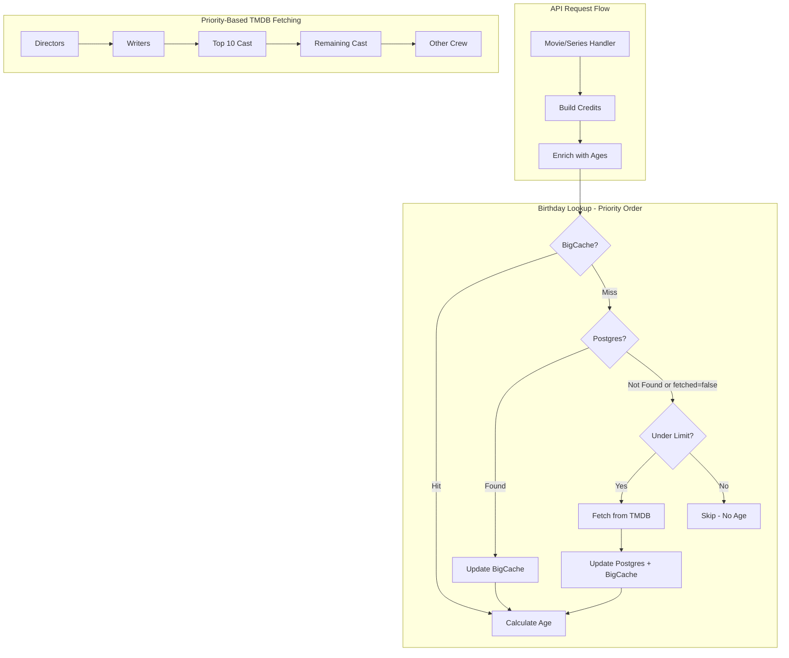
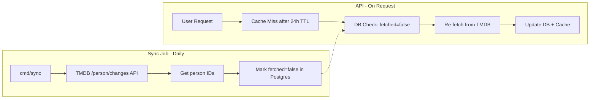
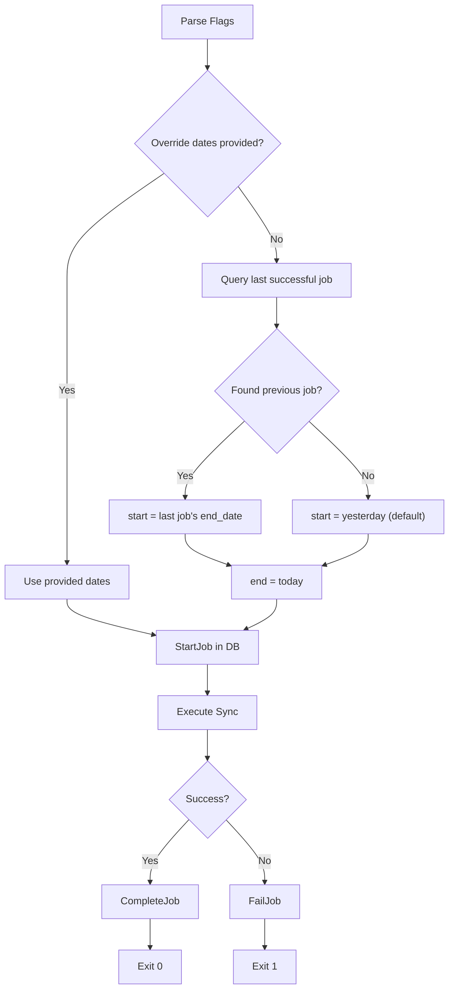

# MiniMovie API

Simple API backend for _MiniMovie_ written in Go.

## Installation

### Install Go

Install Go (v1.25.5+) via Homebrew.

```sh
brew install go
```

> [!IMPORTANT]
> Don't forget to add your Go binary path to your PATH!

### Install Air

Run the following command to install the [Air Live Reloader](https://github.com/air-verse).

```sh
go install github.com/air-verse/air@latest
```

### Run the Application

With live reloading:

```sh
make watch
```

Without live reloading:

```sh
make start
```

## App Structure

```
minimovie-api/
├── cmd/
│   ├── api/
│   │   └── main.go                 # API server entry point
│   └── sync/
│       └── main.go                 # Person sync job (cron)
│
├── config/
│   └── config.go                   # Config definitions and loader
│
├── internal/
│   ├── age/
│   │   ├── age.go                  # Age calculation utilities
│   │   └── resolver.go             # Person age resolver (cache → DB → API)
│   │
│   ├── api/
│   │   ├── router.go               # Chi router setup, registers all routes
│   │   └── handlers/
│   │       ├── handlers.go         # Handler dependencies
│   │       ├── credits.go          # Credits types and functions
│   │       ├── episode.go          # GetEpisode handler
│   │       ├── movie.go            # GetMovie handler
│   │       ├── person.go           # GetPerson handler
│   │       ├── search.go           # SearchMulti handler
│   │       ├── season.go           # GetSeason handler
│   │       ├── series.go           # GetSeries handler
│   │       └── watch.go            # WatchProviders types and functions
│   │
│   ├── httputil/
│   │   └── response.go             # JSON(w, status, data), Error(w, status, msg)
│   │
│   ├── metrics/
│   │   ├── metrics.go              # OpenTelemetry metrics
│   │   └── middleware.go           # HTTP metrics middleware
│   │
│   ├── store/
│   │   ├── bigcache.go             # In-memory cache adapter
│   │   ├── cache.go                # Cache interface
│   │   └── postgres.go             # PostgreSQL person store
│   │
│   └── tmdb/
│       ├── client.go               # TMDB HTTP client
│       ├── changes.go              # GetPersonChanges() for sync
│       ├── collection.go           # GetCollection()
│       ├── credits.go              # Credits, AggregateCredits, CombinedCredits types
│       ├── episode.go              # GetEpisode()
│       ├── metadata.go             # Shared types
│       ├── movie.go                # GetMovie()
│       ├── person.go               # GetPerson()
│       ├── search.go               # SearchMulti()
│       ├── season.go               # GetSeason()
│       ├── series.go               # GetSeries()
│       └── watch.go                # WatchProviders types
│
├── local-development/
│   ├── docker-compose.yml          # Local Postgres setup
│   └── init.sql                    # Database schema
│
├── openapi/
│   ├── minimovie-api.yaml          # API specification
│   └── tmdb.json                   # TMDB API reference
│
├── .env
├── .gitignore
├── env.example
├── go.mod
├── go.sum
├── Makefile
└── README.md
```

## Entities and Functionality

- Search
  - Global
  - Movies
  - Shows
  - Games (TBD)
  - People
- Movies
  - Details
  - People
  - Where to Watch
  - Trailer (TBD) - [API Docs](https://developer.themoviedb.org/reference/movie-videos)
- Shows
  - Details
  - People
  - Where to Watch
  - Trailer (TBD) - [API Docs](https://developer.themoviedb.org/reference/tv-series-videos)
  - Seasons
    - Details
    - People
    - Where to Watch
    - Episodes
      - Details
      - People
- People
  - Movies
  - Shows
  - Games (TBD)
- Games (TBD)
  - Details
  - People
  - Where to Play
  - Trailer (TBD)

## Data Enrichments

### Age Enrichment

Credits for movies, series, seasons, and episodes are enriched with age data calculated from cast/crew birthdays.

#### Flow



#### Data Flow

1. **BigCache** (in-memory, 24h TTL) — fastest, checked first
2. **Postgres** — persistent storage, checked on cache miss
3. **TMDB API** — external source, fetched only when needed

### Person Priority System

TMDB API calls are limited per request to avoid N+1 problems. When fetching is required, people are prioritized:

| Priority | Role        | Notes                     |
| -------- | ----------- | ------------------------- |
| 1        | Directors   | Always fetched first      |
| 2        | Writers     | Screenplay, Story, Writer |
| 3        | Top 10 Cast | By billing order          |
| 4        | Cast 11-25  | Lower priority            |
| 5        | Other Crew  | Fetched last              |

#### Enrichment Output

- **Movies/Episodes**: Single age at release (`ageAtRelease: 32`)
- **Series**: Age range from first to last air date (`ageRange: "25-32"`)

## Deployment

### Observability

- [Grafana Dashboard](https://rossbrandon.grafana.net/d/rofg2q7/minimovie-api-service-metrics?orgId=1&from=now-30m&to=now&timezone=browser)
- [Railway Dashboard](https://railway.com/project/fff7464f-52c9-4e91-b358-632b1e4202fb/observability?environmentId=9f32b1f7-f66e-4146-9982-1ec9aef6f573)
- [Railway Logs](https://railway.com/project/fff7464f-52c9-4e91-b358-632b1e4202fb/logs?environmentId=9f32b1f7-f66e-4146-9982-1ec9aef6f573)

### Cloudflare

#### API Allowlist

The following [Security Rule](https://dash.cloudflare.com/dd630cbdf4b6a4502d25f006d309725c/minimovie.info/security/security-rules) has been defined for the `api.minimovie.info` domain.

```
(http.host eq "api.minimovie.info"
and not http.request.uri.path in {"/ping" "/search"}
and not starts_with(http.request.uri.path, "/series/")
and not starts_with(http.request.uri.path, "/people/")
and not starts_with(http.request.uri.path, "/movies/")
and not starts_with(http.request.uri.path, "/series/")
)
```

## Change Sync Logic

In order to keep the cache up to date with TMDB (ie when a person dies), a daily job is run to allow the data to be refreshed from TMDB.

The default behavior will be to pull the past day's changes, but these can be overridden via:

1. env variables: `SYNC_START_DATE` and `SYNC_END_DATE`
2. Command flags: `make sync START=2026-01-01 END=2026-01-05`

Sync Flow:



Sync Status Tracking:


