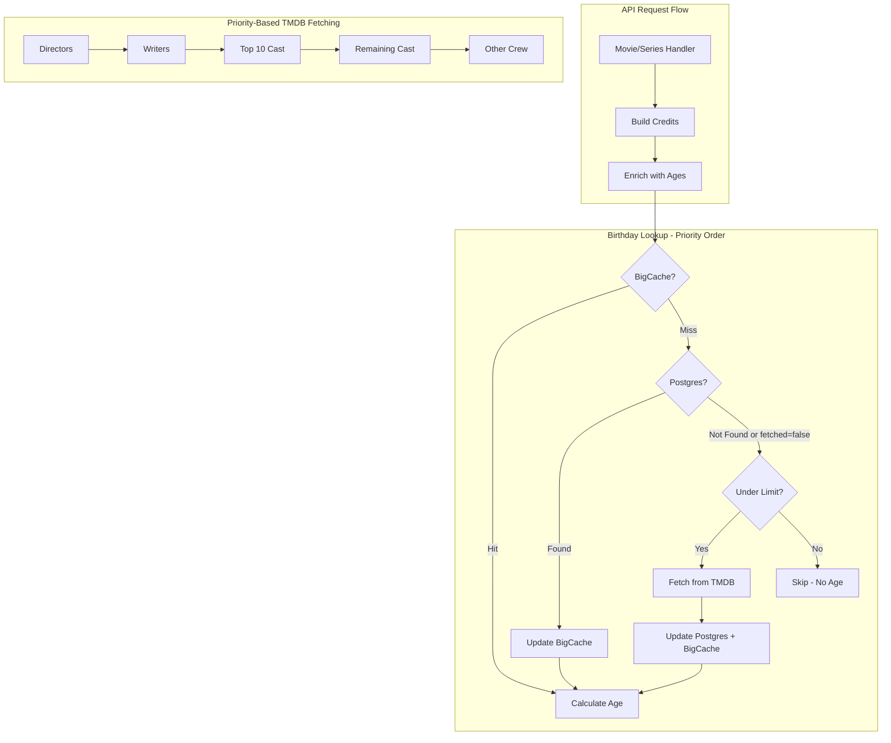
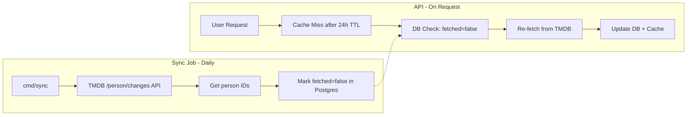
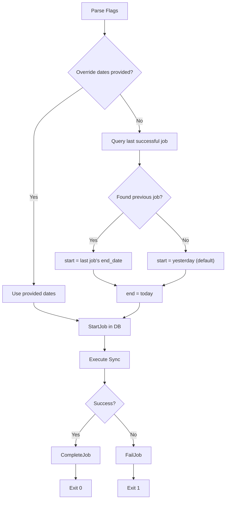

# MiniMovie API

Simple API backend for _MiniMovie_ written in Go.

## Installation

### Install Go

Install Go (v1.25.5+) via Homebrew.

```sh
brew install go
```

> [!IMPORTANT]
> Don't forget to add your Go binary path to your PATH!

### Install Air

Run the following command to install the [Air Live Reloader](https://github.com/air-verse).

```sh
go install github.com/air-verse/air@latest
```

### Run the Application

With live reloading:

```sh
make watch
```

Without live reloading:

```sh
make start
```

## App Structure

```
minimovie-api/
├── cmd/
│   ├── api/
│   │   └── main.go                 # API server entry point
│   ├── cleanup/
│   │   └── main.go                 # Expired record purge job (cron)
│   ├── seed/
│   │   ├── main.go                 # Catalog seed CLI (local only): download, save, hydrate, update, status
│   │   ├── root.go                 # Cobra root, --entity flag, exit codes, signal handling
│   │   ├── download.go             # Download the daily TMDB id export files
│   │   ├── save.go                 # Tier 1: skeleton rows from an export file, zero API calls
│   │   ├── hydrate.go              # Tier 2: the next --limit not-yet-hydrated rows, most popular first
│   │   ├── update.go               # Changes feed since the last update, flag, refresh
│   │   ├── status.go               # Table counts and last-run summary
│   │   ├── session.go              # Config, log file, database and TMDB client for one run
│   │   ├── state.go                # Per-entity checkpoint file (--resume)
│   │   ├── progress.go             # Per-row and per-batch callbacks: counters and the status line
│   │   └── term.go                 # In-place status line above the log output
│   └── sync/
│       └── main.go                 # Person sync job (cron)
│
├── config/
│   └── config.go                   # Config definitions and loader
│
├── internal/
│   ├── achievements/
│   │   ├── checkers.go             # Achievement checkers
│   │   ├── checkers_test.go        # Integration tests
│   │   ├── definitions.go          # Achievement definitions (IDs, names, descriptions)
│   │   └── worker.go               # Background achievement worker
│   │
│   ├── age/
│   │   ├── age.go                  # Age calculation utilities
│   │   └── resolver.go             # Person age resolver (cache → DB → API)
│   │
│   ├── catalog/
│   │   ├── catalog.go              # Service, Entity, Deps: the one write path for TMDB data
│   │   ├── changes.go              # SyncChanges: changes feed to stale flags
│   │   ├── fetch.go                # getX/fetchX: network half, then writes (row in the transaction, shared rows outside)
│   │   ├── people.go               # Credited people: list-grade seeding and the capped priority fetch
│   │   ├── payload.go              # tmdb.* to store.* row mappers (typed columns + pruned payload)
│   │   ├── slug.go                 # ParseSlugID: the leading id of a slug
│   │   ├── hydrate.go              # Batched, transactional hydration: concurrent batches, claim by work class
│   │   └── seed.go                 # Streams a gzipped id export into skeleton rows
│   │
│   ├── api/
│   │   ├── router.go               # Chi router setup, registers all routes
│   │   ├── middleware/
│   │   │   ├── auth.go             # Session auth middleware
│   │   │   └── cors.go             # CORS configuration
│   │   └── handlers/
│   │       ├── handlers.go         # Handler dependencies
│   │       ├── helpers.go          # Shared handler helpers
│   │       ├── account.go          # DeleteAccount, ExportUserData
│   │       ├── achievements.go     # Achievements list, unseen, mark seen
│   │       ├── auth.go             # BeginAuth, AuthCallback, ExchangeToken, GetSession, Logout
│   │       ├── credits.go          # Credits types and functions
│   │       ├── episode.go          # GetEpisode handler
│   │       ├── interesting.go      # Person interesting info (augur)
│   │       ├── movie.go            # GetMovie handler
│   │       ├── notifications.go    # Apple server-to-server notifications
│   │       ├── person.go           # GetPerson handler
│   │       ├── person_series.go    # Person series credits handler
│   │       ├── revocation.go       # Token revocation
│   │       ├── search.go           # SearchMulti handler
│   │       ├── season.go           # GetSeason handler
│   │       ├── series.go           # GetSeries handler
│   │       ├── stats.go            # User stats handler
│   │       ├── watch.go            # WatchProviders types and functions
│   │       ├── watch_events.go     # Watch event CRUD
│   │       └── watchlist.go        # Watchlist CRUD
│   │
│   ├── auth/
│   │   ├── oidc.go                 # OIDC provider registry (zitadel/oidc)
│   │   └── apple_secret.go         # Apple client_secret JWT generation
│   │
│   ├── httputil/
│   │   └── response.go             # JSON(w, status, data), Error(w, status, msg)
│   │
│   ├── metrics/
│   │   ├── metrics.go              # OpenTelemetry metrics
│   │   └── middleware.go           # HTTP metrics middleware
│   │
│   ├── store/
│   │   ├── pool.go                 # PostgreSQL connection pool
│   │   ├── cache.go                # Cache interface
│   │   ├── person_cache.go         # In-memory person birthday cache
│   │   ├── season_cast_cache.go    # In-memory season cast cache
│   │   ├── catalog.go              # Shared catalog table ops: claim, mark stale, purge, stats
│   │   ├── movie_store.go          # movies: hydrated and skeleton upserts, reads
│   │   ├── series_store.go         # series
│   │   ├── season_store.go         # seasons (skeletons from the series document)
│   │   ├── episode_store.go        # episodes (skeletons from the season document)
│   │   ├── collection_store.go     # collections
│   │   ├── achievement_store.go    # Achievement store
│   │   ├── auth_code_store.go      # One-time auth code store
│   │   ├── interesting_info_store.go # LLM-enriched person info store
│   │   ├── notification_store.go   # Apple notification dedup store
│   │   ├── person_store.go         # PostgreSQL person store
│   │   ├── season_cast_store.go    # Season aggregate cast store
│   │   ├── session_store.go        # Session store
│   │   ├── stats_store.go          # User stats store
│   │   ├── sync_job.go             # Sync job store operations
│   │   ├── user_store.go           # User + OAuth account store
│   │   ├── watch_event_store.go    # Watch event store
│   │   └── watchlist_store.go      # Watchlist store
│   │
│   └── tmdb/
│       ├── client.go               # TMDB HTTP client
│       ├── changes.go              # GetChanges() over the movie, tv, and person feeds
│       ├── collection.go           # GetCollection()
│       ├── credits.go              # Credits, AggregateCredits, CombinedCredits types
│       ├── episode.go              # GetEpisode()
│       ├── media_metadata.go       # TMDB metadata resolution for watch events
│       ├── metadata.go             # Shared types
│       ├── movie.go                # GetMovie()
│       ├── person.go               # GetPerson()
│       ├── search.go               # SearchMulti()
│       ├── season.go               # GetSeason()
│       ├── series.go               # GetSeries()
│       └── watch.go                # WatchProviders types
│
├── local-development/
│   ├── api-examples.md             # Curl/HTTP examples for all endpoints
│   ├── docker-compose.yml          # Local Postgres setup
│   └── init.sql                    # Database schema
│
├── openapi/
│   ├── minimovie-api.yaml          # API specification
│   └── tmdb.json                   # TMDB API reference
│
├── .env
├── .gitignore
├── env.example
├── go.mod
├── go.sum
├── Makefile
└── README.md
```

## Entities and Functionality

- Search
  - Global
  - Movies
  - Shows
  - Games (TBD)
  - People
- Movies
  - Details
  - People
  - Where to Watch
  - Trailer (TBD) - [API Docs](https://developer.themoviedb.org/reference/movie-videos)
- Shows
  - Details
  - People
  - Where to Watch
  - Trailer (TBD) - [API Docs](https://developer.themoviedb.org/reference/tv-series-videos)
  - Seasons
    - Details
    - People
    - Where to Watch
    - Episodes
      - Details
      - People
- People
  - Movies
  - Shows
  - Games (TBD)
- Games (TBD)
  - Details
  - People
  - Where to Play
  - Trailer (TBD)
- User
  - Watchlist (want_to_watch / watched)
  - Watch Events (movie / series / season / episode)
  - Stats (movies watched, series completed, episodes watched, hours, streaks, genre breakdown)
  - Achievements (gamification badges earned via watch activity)
  - Account management (delete, export)

## Authentication

OAuth 2.0 / OpenID Connect via [zitadel/oidc](https://github.com/zitadel/oidc). Supports Google and Apple Sign-in.

## Data Enrichments

### Age Enrichment

Credits for movies, series, seasons, and episodes are enriched with age data calculated from cast/crew birthdays.

#### Flow


```mermaid
flowchart TD
    subgraph request [API Request Flow]
        A[Movie/Series Handler] --> B[Build Credits]
        B --> C[Enrich with Ages]
    end

    subgraph lookup [Birthday Lookup - Priority Order]
        C --> D{BigCache?}
        D -->|Hit| H[Calculate Age]
        D -->|Miss| E{Postgres?}
        E -->|Found| F[Update BigCache]
        F --> H
        E -->|Not Found or fetched=false| G{Under Limit?}
        G -->|Yes| I[Fetch from TMDB]
        G -->|No| J[Skip - No Age]
        I --> K[Update Postgres + BigCache]
        K --> H
    end

    subgraph priority [Priority-Based TMDB Fetching]
        L[Directors] --> M[Writers]
        M --> N[Top 10 Cast]
        N --> O[Remaining Cast]
        O --> P[Other Crew]
    end
```

#### Data Flow

1. **BigCache** (in-memory, 24h TTL) — fastest, checked first
2. **Postgres** — persistent storage, checked on cache miss
3. **TMDB API** — external source, fetched only when needed

### Person Priority System

TMDB API calls are limited per request to avoid N+1 problems. When fetching is required, people are prioritized:

| Priority | Role        | Notes                     |
| -------- | ----------- | ------------------------- |
| 1        | Directors   | Always fetched first      |
| 2        | Writers     | Screenplay, Story, Writer |
| 3        | Top 10 Cast | By billing order          |
| 4        | Cast 11-25  | Lower priority            |
| 5        | Other Crew  | Fetched last              |

#### Enrichment Output

- **Movies/Episodes**: Single age at release (`ageAtRelease: 32`)
- **Series**: Age range from first to last air date (`ageRange: "25-32"`)

## Catalog Seed

The catalog tables (`movies`, `series`, `seasons`, `episodes`, `collections`, `people`) hold TMDB data in Postgres: an identity `id` of our own, the provider's id as `source_id`, a `slug` generated from id and title (`155-the-dark-knight`; routes resolve it by the leading id), typed columns for what is filtered, sorted, or joined on, and the pruned TMDB document as `payload`. `cmd/seed` fills them from a laptop, never from Railway (only the api, sync, and cleanup binaries deploy).

```sh
make seed
bin/seed download --date $(date -v-1d +%m_%d_%Y)                                # movie_ids, tv_series_ids, person_ids
bin/seed save --entity people --file local-development/exports/person_ids_<date>.json.gz
caffeinate -is -- bin/seed hydrate --entity people --limit 100000                  # the next 100k unhydrated rows; rerun for more; then movies, series
bin/seed update                                                                     # changes feed since the last update, then refresh; --entity to pick one
bin/seed status
```

People go first so titles find their credits already hydrated. `save` is an idempotent upsert with zero API calls; `hydrate` claims never-hydrated rows by popularity, at or above `--min-popularity` (default 0.7), and runs the same fetch path the API uses, up to `--api-rate-limit` requests per second (default 40; TMDB's ceiling is about 50). Every run writes `local-development/exports/seed-<entity>.log` (JSON, debug level) and checkpoints `local-development/exports/state/<entity>.json` after every batch, so Ctrl-C is safe and the same command with `--resume` continues. `hydrate --limit N` hydrates the next N not-yet-hydrated rows; a row that failed or was interrupted is still unhydrated and is simply claimed again next time. `update` asks the changes feed which of our hydrated rows moved since the last update (the window starts at the last completed `sync_job_status` row for that entity, or a day before its oldest hydrated row; `--start`/`--end` override it), flags them, and refreshes every flagged or expiring row; rows TMDB has removed are deleted. Exit codes: 0 done, 1 failed, 2 usage or guard, 130 interrupted.

To move a local seed to another database, by hand: `pg_dump -Fc --no-owner --no-privileges -t movies -t series -t seasons -t episodes -t collections -t people "$DATABASE_URL" -f catalog.dump`, then against the target `psql -v step=extensions -f local-development/upgrade-catalog.sql`, `pg_restore --clean --if-exists --no-owner --no-privileges -j 4 -d "$TARGET" catalog.dump`, and `psql -v step=finish -f local-development/upgrade-catalog.sql` (carry-forward, user-row remap, drops).

## Change Sync Logic

In order to keep the cache up to date with TMDB (ie when a person dies), a daily job is run to allow the data to be refreshed from TMDB.

The default behavior will be to pull the past day's changes, but these can be overridden via:

1. env variables: `SYNC_START_DATE` and `SYNC_END_DATE`
2. Command flags: `make sync START=2026-01-01 END=2026-01-05`

Sync Flow:


```mermaid
flowchart LR
    subgraph sync_job [Sync Job - Daily]
        A[cmd/sync] --> B[TMDB /person/changes API]
        B --> C[Get person IDs]
        C --> D[Mark fetched=false in Postgres]
    end

    subgraph api [API - On Request]
        E[User Request] --> F[Cache Miss after 24h TTL]
        F --> G[DB Check: fetched=false]
        G --> H[Re-fetch from TMDB]
        H --> I[Update DB + Cache]
    end

    D -.-> G
```

Sync Status Tracking:


```mermaid
flowchart TD
    A[Parse Flags] --> B{Override dates provided?}
    B -->|Yes| D[Use provided dates]
    B -->|No| C[Query last successful job]
    C --> E{Found previous job?}
    E -->|Yes| F["start = last job's end_date"]
    E -->|No| G["start = yesterday (default)"]
    F --> H["end = today"]
    G --> H
    D --> I[StartJob in DB]
    H --> I
    I --> J[Execute Sync]
    J --> K{Success?}
    K -->|Yes| L[CompleteJob]
    K -->|No| M[FailJob]
    L --> N[Exit 0]
    M --> O[Exit 1]
```
